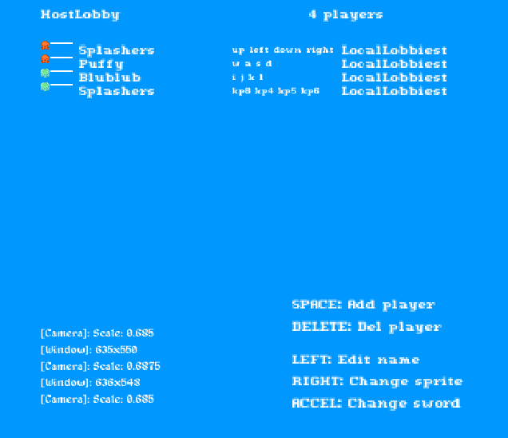
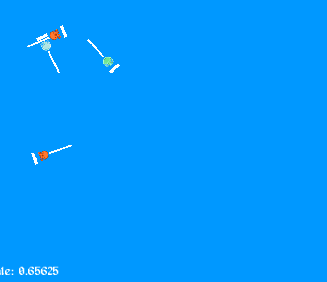

# HorseSeaHorse
HorseSeaHorse is an tank-control duel-ish game, where valiant non-horses are
pitted against one another.




It was made for [LibreJam 2020-02](https://bytecrab.org/librejam/202102.html) of
the theme “SUBNAUTICAL,” where it tied with [f-a](https://www.ariis.it/)’s
[Pigafetta](https://www.ariis.it/static/articles/game-misc/page.html).


## Running
Monkune should run just fine on any operating system with
[LÖVE](https://love2d.org) — including GNU/Linux, BSD, Haiku, and even Windows..

### UNIX-adjacent
Download the `horseseahorse.love` file from
[Releases](https://hak.xwx.moe/jadedctrl/HorseSeaHorse/releases/).
Make sure LÖVE (`love2d`) is installed through your package manager,
then run:

`$ love horseseahorse.love`

### Windows
Download the Win32 archive from [Releases](https://hak.xwx.moe/jadedctrl/HorseSeaHorse/releases/), then extract `
horseseahorse-win32.zip`.  
Inside, you’ll find `horseseahorse.exe`. Run it!


## Building
The LÖVE file (`.love`) and Windows binary can be made using the Makefile.  
Make sure you have LÖVE installed on your system, then run:

```
$ make love
$ make win32
```


## Meta
Author is Jaidyn Ann <jadedctrl@posteo.at>  
Code under GPLv3 (see COPYING.txt)  
Sprites all under the CC-BY 4.0  
Music (*.ogg) all under the CC-BY 3.0 (by Kevin MacLeod)  
Music (*.wav) all under the GPL (by Ziz of Hase)
